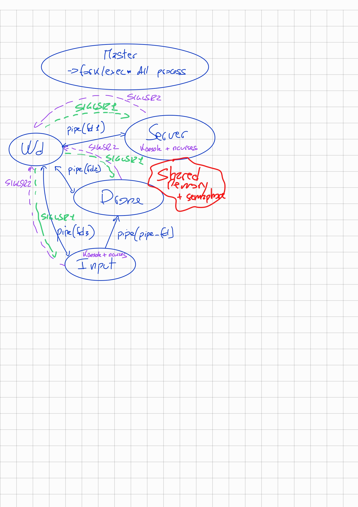

# First assignment  

Project of Andrea Chiappe s4673275, Simone Lombardi s6119159

## Drone simulator  
In this simulator the drone is rappresented by a X inside a windows.
The drone has 8 degreeds of freedom in the plane, it could move up, down, right, left, and in all the four diagonal.
When the simlator is open, you will see two windows, one with the drone and the other with the keys on keyboard is possible to push.
Every keys correspond to a force apply at the drone. It will be expleined after.

### Instalation

For run the simulaton, you need to have in the same folder the file: master.c, server.c, drone.c, input.c and gccfile.sh.
Then in the termnal run:

run ./gccfile.sh

The `gccfile.sh` script will create a new folder named "build_process" containing the executable file, the logfile with information about the process and their state, any errors, and all the system information.

### Use of Simulator

You can interact with the simulator by typing 8 different keys: D, S, F, E, C, W, R, X, V. If you push one of these keys, the drone will move in one of the allowable directions corresponding to the pushed key. The idea is that when you push one of these keys, a step of force is applied to the drone, allowing it to move in the desired direction. Pushing the same key multiple times increases the force and, consequently, the speed. Each time you push the same key, the force increases by one step. To stop the drone, you can push the D key to remove all the force, or type the opposite keys compared to the drone's directions. When different keys are pushed, the drone moves in the resultant direction, which is the sum of all the applied forces.

The keys you can push are:
- **D:** Decrease one step of all the forces in the game
- **S:** Move the drone to the left
- **F:** Move the drone to the right
- **E:** Move the drone up
- **C:** Move the drone down
- **W:** Move the drone up-left diagonal
- **R:** Move the drone up-right diagonal
- **X:** Move the drone down-left diagonal
- **V:** Move the drone down-right diagonal

 
 
### Project Structure

The simulator, written in POSIX standard, consists of 5 processes working concurrently: `master.c`, `server.c`, `drone.c`, `input.c`, and `wd.c`.

- **`master.c`:** Creates all processes using fork/exec* sys calls. It creates the server and input processes for a graphical interface. This process also creates the necessary pipes for communication between processes. One pipe is for communication between drone-input to transfer pushed keys, and others allow communication between every process with the watchdog to send its own process_id. This process waits for the end of the execution of all created processes.

- **`input.c`:** Captures pushed keyboard keys and sends them to the drone process through a pipe. It uses the ncurses library to print and higlight the button and is executed in master with konsole, so the input window with pushed keys is displayed when the game opens. 

- **`drone.c`:** Computes the position, velocity, and dynamics of the drone and sends the data to the server through a shared memory segment controlled by two. The process uses the select syscall to periodically check the pipe arriving from the input process, if the pipe is ready the new input is converted in the corresponding force and applied to the drone. 

- **`server.c`:** Prints the position of the drone on the terminal using the ncurses library. Manages shared memory for communication with the drone. After reciveing the data (posiiton) from the drone process prints the drone in the position recived. There is a control to prevent the server process to print the drone icon if the position has not changed from the previous one. 

- **`wd.c`:** Checks if all processes are running correctly. The watchdog works with signals, sending a signal to a different process every second. The process that receives the signal sends another signal back to the watchdog to inform that it is working. If the watchdog receives the signal back, everything is okay; otherwise, it means that the process wasn't working correctly, and it kills all the processes. At the start, the watchdog reads process ids from the pipes because opening them with konsole, the pid is not the same as returned from exec in the master process.

### Example of use 

A simple example of the use of the simulator is, for example: If I push the F key on the keyboard, the drone, identified by an X in the window, will move to the right with a force of "one." If I push the F key again, the drone will move faster to the right of the window. To stop the drone, I can:
- Push the D key, which reset all the forces in the game. The drone will stop as an effect of the drag in the simulation.
- Push the S key, to increase the force in the opposite direction, pushing S the same number of times of F will have the same effect of pressing D, but if you press S one more time the drone will stop than procede in the S direction with force of "one".

In this assignment, the boundaries of the window are not delimited, so the drone could go outside the window, becoming invisible.

